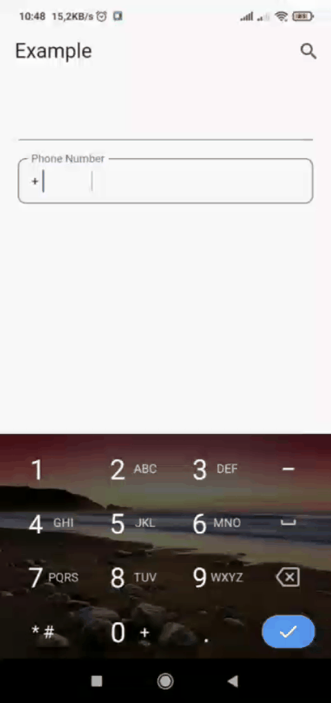

# PhoneNumberField

A customised Flutter TextFormField to input international phone number along with country code.

This widget can be used to make customised text field to take phone number input for any country along with an option to choose country code from a custom widgets.

---

## Screenshots & Preview

<table>
  <tr>
    <td>
      
    </td>
    <td>
      
    </td>
    <td>
      
    </td>
  </tr>
</table>


## ✨ Features

- ✅ Formats phone numbers
- 📦 Supports 200+ countries
- 🧩 Supports auto-completion
- 🔍 Supports search
- 📝 Supports custom widget
- 📱 Auto-format
- 🎉 Easy to use
- 🚀 Fast and stable
- 🌟 Easy to customize

---

## 📦 Installation

Add `phone_number_field` to your `pubspec.yaml`:

```yaml
dependencies:
  phone_number_field: ^1.0.0
```

Then, import the phone_number_field package into your project.

## Usage

```dart
import 'package:flutter/material.dart';
import 'package:phone_number_field/phone_number_field.dart';

void main() {
  runApp(const MyApp());
}

class MyApp extends StatelessWidget {
  const MyApp({super.key});

  // This widget is the root of your application.
  @override
  Widget build(BuildContext context) {
    return MaterialApp(
      title: 'Flutter Demo',
      theme: ThemeData(colorScheme: ColorScheme.fromSeed(seedColor: Colors.deepPurple)),
      home: HomePage(),
    );
  }
}

class HomePage extends StatefulWidget {
  const HomePage({super.key});

  @override
  State<HomePage> createState() => _HomePageState();
}

class _HomePageState extends State<HomePage> {
  late TextEditingController _controller;
  Country? _country;

  @override
  void initState() {
    _controller = TextEditingController();
    super.initState();
  }

  @override
  void dispose() {
    _controller.dispose();
    super.dispose();
  }

  @override
  Widget build(BuildContext context) {
    return Scaffold(
      appBar: AppBar(
        title: Text('Example'),
        actions: [
          IconButton(
            onPressed: () {
              showSearch(context: context, delegate: CountrySearchDelegate()).then((value) {
                if (value != null) {
                  setState(() {
                    _country = value;
                  });
                }
              });
            },
            icon: Icon(Icons.search),
          ),
        ],
      ),
      body: Padding(
        padding: const EdgeInsets.all(20.0),
        child: Column(
          spacing: 20,
          children: [
            TextField(controller: _controller, readOnly: true),
            PhoneNumberField(
              initialCountry: _country,
              label: 'Phone Number',
              isLabelInside: false,
              onCountrySelected: (country) {
                _controller.text = '${country?.emoji ?? ''} ${country?.name ?? ''}';
              },
              onCompleted: (value) {
                print("phone number => $value");
              },
            ),
          ],
        ),
      ),
    );
  }
}
```                         

---

## ⚙️ Configuration Options

| Parameter              | Type                | Default                           | Description                                                                                                        |
|------------------------|---------------------|-----------------------------------|--------------------------------------------------------------------------------------------------------------------|
| `onCountrySelected`    | `Function`          | `null`                            | It works if a matching country is found for the country code; otherwise, it may return null.                       |
| `initialCountry`       | `Country`           | `null`                            | It is used to set the selected country code either through search or a custom widget.                              |
| `initialCountryCode`   | `String`            | `null`                            | To set a default country code (e.g., "998") when the `TextField` is created.                                       |
| `label`                | `String`            | `true`                            | Label for the `TextField`.                                                                                         |
| `focusColor`           | `Color`             | `primaryColor`                    | Used for the border color when the `TextField` is focused.                                                         |
| `borderColor`          | `Color`             | `secondaryColor`                  | Used for the border color when the `TextField` is unfocused.                                                       |
| `borderRadius`         | `double`            | `8`                               | Used to define the border radius.                                                                                  |
| `labelStyle`           | `TextStyle`         | `null`                            | Used to apply a text style to the label.                                                                           |
| `isLabelInside`        | `bool`              | `false`                           | Determines whether the label text is placed inside the border or above it.                                         |
| `onChanged`            | `Function`          | `null`                            | Triggered when there is a change in the `TextField`.                                                               |
| `onCompleted`          | `Function`          | `null`                            | Triggered when input in the `TextField` is completed; returns the full phone number, for example: "+998901234567". |
| `suffix`               | `Widget`            | `null`                            | Used for the suffix widget of the `TextField`.                                                                     |
| `contentPaddingCode`   | `EdgeInsetGeomatry` | `const EdgeInsets.only(left: 14)` | Padding for the country code section.                                                                              |
| `contentPaddingNumber` | `EdgeInsetGeomatry` | `const EdgeInsets.only(left: 14)` | Padding for the phone number section.                                                                              |

---

## 📬 Feedback & Issues

We'd love to hear your thoughts and help improve the package!

If you:

- Encounter a bug 🐞
- Notice something not working as expected ⚠️
- Have suggestions for improvements 💡
- Want to request a new feature ✨

Please don't hesitate to [open an issue](../../issues). When reporting a bug, try to include:

- A brief but clear description of the issue
- Steps to reproduce it
- Your environment (Flutter version, platform, etc.)
- Screenshots or logs (if applicable)

Your feedback is incredibly valuable — thank you for helping us make this project better! 🙌


## 📄 License

This project is licensed under the MIT License.  
See the [LICENSE](LICENSE) file for details.
